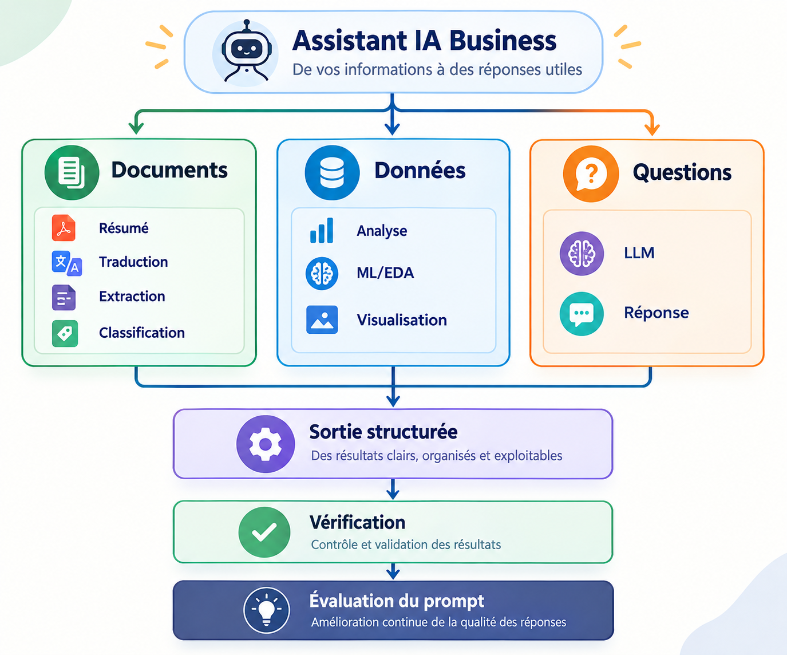

# AI Business Assistant : Mini Projet Prompt Engineering

# Architecture

<p align="center">
  
</p>

## Description

Ce dépôt regroupe la réalisation de mini projet Prompt Engineering visant à concevoir progressivement les prompts d'un **AI Business Assistant**, un assistant IA polyvalent capable d'aider des collaborateurs à :

- exploiter des documents (résumé, traduction, extraction, classification)
- analyser des données (ML/EDA, visualisation)
- répondre à des questions via un LLM
- produire des sorties structurées, vérifiées et évaluées

## Structure du mini projet

| Partie | Contenu |
|---|---|
| 1 | Anatomie d'un prompt |
| 2 | Comparaison des techniques de prompting (zero-shot, one-shot, few-shot, structuré) |
| 3 | Prompt Engineering et raisonnement (décomposition, auto-vérification) |
| 4 | Sorties structurées (JSON + règles de validation) |
| 5 | Prompts pour applications métier (résumé, traduction, ticket IT, facture, email client) |
| 6 | Prompt Engineering pour le Machine Learning (dataset capteurs, visualisations, modèles, métriques) |
| 7 | Prompt Engineering et RAG |
| 8 | Évaluation et optimisation des prompts |
| 9 | Bonus |

## Réalisation

- **Fichier principal** : [mini_projet_prompt_engineering.ipynb](mini_projet_prompt_engineering.ipynb). Pour chaque tâche, il présente le prompt utilisé, la capture de la réponse et les observations.
- **LLM utilisé** : ChatGPT (interface web).

## Organisation du dépôt

```
ai-business_assistant/
├── README.md
├── mini_projet_prompt_engineering.ipynb   # réalisation de l'atelier
└── data/
    ├── mesures_capteurs.csv               # dataset des capteurs (Partie 6)
    └── politique_retours_shopnet.txt      # document utilisé pour le RAG (Partie 7)
```

## ✍️ Auteur

**Harouna MBAYE**
- GitHub : [@harounambaye](https://github.com/harounambaye)
- LinkedIn : [Harouna Mbaye](https://www.linkedin.com/in/harouna-mbaye-088926239/)
- Portfolio :[harouna-mbaye](https://harouna-mbaye.netlify.app/)
- Email : roonmbaye5@gmail.com
